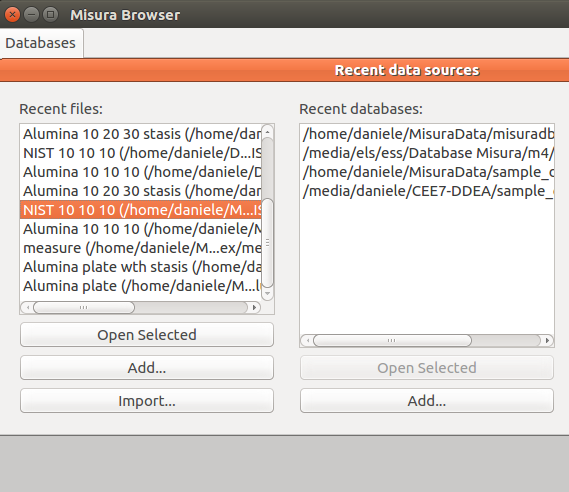

.. include:: ../substitutions.txt

.. _datasources:
    
Data Sources
============

Data Sources is always the first Browser's tab, and is not possible to close it. The tab is mostly empty, displaying the gray background. 

Any :term:`HDF5` Misura file can be dragged from your file system browser and dropped into this gray area. 
The file will be immediately opened in a new tab.

The only visible sub-window on startup is ``Recent Data Sources``, displaying two columns: one for recently opened files; one for recently accessed databases. 
More columns might be displayed by plugins.

The recently opened tests listing is a quick way to directly re-open any recent file, no matter if it is indexed in a database. 
To open a file from the recent files column, either:

- Double-click on the file
- Select the file, then click on the ``Open selected`` button
- Click on the ``Add`` button then select the file anywhere from the file-system.
- If any data import plugin is enabled, an ``Import`` button is also visible, 
  which allows to select a foreign data format and convert it to a compatible :term:`HDF5`. The converted file will be opened.

If a recent file is double-clicked from the list, or selected from the file system using the , it is opened in a new Test Window, in a new tab. 
The more recently accessed file is placed at the top of the list.

The more convenient way to open a test file is to query the database index.

.. _database:

Database Indexes
----------------

|m| databases are a way to organize and search large amounts of tests, and for finding or establishing relations between them.

They are advanced indexes, collecting all important information about each test (metadata) but not storing any raw dataset. 

They are ephermeral, in the sense that they can be safely removed and recreated identical from the same set of files. 
They do not hold any unique information about your test. All information is actually saved only into the test files or into the plotting files.

There should always be a default database defined at the top of the list. 
This is the database where finished tests are automatically saved and indexed, configured in :ref:`preferences` under **Default database** option. 

If you would like to open a database which is not listed in the ``Recent databases`` column, you can ``Add`` it from the below button, 
or click on :menuselection:`File --> Open database` menu action in the main Browser window.
    
You can **create a database index** out of any structure of folders containing some Misura tests (and any other file type, which will be skipped). 
To create a new database, select the ``File -> New database`` menu action. It will ask the name and location of the database index. 
The database index must be placed on the topmost folder in your folder structure. 
After confirmation, the folder where the database index is being created will be scanned as well as any sub-folder, recursively.

Databases can be located on a network share, to enable multi-user collaboration. 
Every client which needs to access the output files or the machine can configure it as its **Default database** in :ref:`preferences`, 
so finished tests are automatically added to that location only once.
        
This is an easy way to collaborate on data post-processing. It is advisable to save also the plots in the same, shared folder, 
so any user participating in the network will be able to open them.

        
.. warning::
    You might experience problems if a Linux client is accessing a database on a windows share through Samba. You will probably need to disable byte range locks by setting the ``nobrl`` flag when mounting the CIFS filesystem. Example ``/etc/fstab`` entry: ``//192.168.0.1/database /media/database cifs rw,users,nobrl,user=misura,pass=xxxx,exec 0 0``
        

Database Dialog
---------------

The interface towards a database is the **Database Dialog**. A new database dialog sub-window will be added to the Data Sources tab
 every time a database index is opened. 

It shows a listing with all indexed tests, plus a query line with some filtering options to filter the list. 

The toolbar holds two buttons: ``Refresh``, ``Rebuild``. 

- ``Refresh`` will search for indexed files that no longer exist and for new files that are still not indexed.
- ``Rebuild`` will clear the current listing and rebuild entirely from the files found in the same folder or below the folder where the database file is located.

The query line allows to match the input line against one database column at a time. Select the column name, insert the text to be searched and press enter. A special ``All`` filter will match simple text against all text column (name, file name, id, instrument type, etc).

Every line listed in the table represents one test. By double-clicking on a line, the test is opened in a new browser's tab. By right-clicking on a line, a context menu displays some actions relative to the selected test:

- ``Open selected tests``: open the currently selected test (as double-click). 
  Multiple lines can be selected by pressing ``Ctrl`` key while clicking. In case multiple lines were selected, all tests will be opened in new tabs.
- ``Add to``: This action displays a sub-menu, listing all currently opened tabs (tests). 
  By clicking on a tab name, the selected test will be **added** to the already opened tab. 
  In this way, it is possible to compare multiple tests in the same browser window.
- ``View folder``: Open the file system folder containing the test file. 
- ``Delete``: Delete selected file/s. Will ask a confirmation.

While cells ``Name`` or ``Column`` are selected, it is possible to press the ``F2`` key to rename the test or edit the comment.

The database dialog can be created also from :ref:`plotting` menu, :menuselection:`Misura --> Recent databases`.
In this case, double-clicking on a test will add its datasets to the active document, and default plots to be created and overimposed to any existing plot.
  

    

