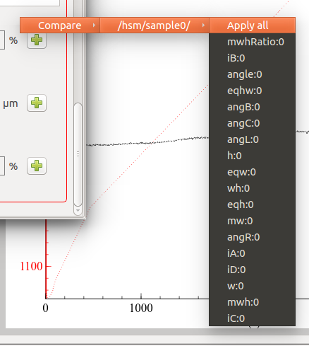
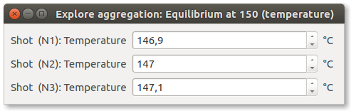

.. include:: /substitutions.txt

.. _components:

Components and options 
======================

The configuration of a test involves many different components of the system: the measurement definition, one or more samples, the thermal cycle. 

Under the hood, many other components are configured automatically or based on the user's input: real physical devices (cameras, motors, power controllers, etc) 
and virtual components like sub-samples (Left/Right/Center, Base/Heigt), feedback regulators, the instrument itself, etc.

All these configurations are defined and saved in a consistent hierarchy of components both in the live instrument and in the output file. 

Each component defines several options: all summed up, they represent the **component's configuration**. 
Component configurations can be saved as **Configuration presets**, and recalled by their name to quickly get the component back in the desired configuration.

The user interface displays a component configuration as a **Configuration panel**: 
a structured list containing all available options (according to the user's :ref:`access-management`).

Components are organized in a hierarchical way, in order to make easier to search for them and to automate some actions on group of related components.

.. _panels:

Configuration panel
-----------------------
A configuration panel lists all options related to a single component. For example, left-side panel in :ref:`live_config`, is a configuration panel. 

It can contain tabs, one for each major configuration section. 
For example, shape identification standards, listed as tabs in microscope :ref:`microscope_shapes`, 
are configuration sections.

The options listing can be divided up to 3 boxes, one for each option role:

* **Configuration**: options which can be edited by the user.
* **Status**: options which are generally changed server-side to reflect internal status. The user can interact with some of them. 
* **Results**: options which represent the output of a server process - usually read-only. 

Box visibility can be toggled by clicking on the checkbox near the header.

.. image:: ../_static/config_sections_collapsed.png
	:scale: 80%
	

.. _options:

Configuration options 
-----------------------

|m4| offers a unified experience to visualize and edit any variable, generically called **Option**. 

Options can represent proper **Configuration** variables, which the user can change to obtain an effect, 
but also the **Status** of some server-side variable, or a read-only **Result** from an analysis.

This distinction is well visible in any configuration panel, where options are grouped in 3 boxes - one for each role.

Options have types (String, Integer, Float, etc) which determine their appearance in the user interface. 

All options share a common representation pattern: a label, containing the option's name, and the option value. 
The option value can be represented as an input box (for text), a spinbox (for numbers), a slider and a spinbox (for number with boundaries), 
a combo-box (for selections), a checkbox (for booleans), etc.

**Read-only** options usually appear as simple text labels, without any control associated with editing. Some read-only option types, like tables, have no visual distinction: 
editing interactions are simply disabled.

If a numerical option has an associated measurement unit, it will be displayed between the label and the value.

.. _option_group:

Sub-options and groups
^^^^^^^^^^^^^^^^^^^^^^^

An option can have sub-options, which are hidden by default. Sub-options usually represent fine-tuning aspects of the parent option. 

The presence of sub-options is indicated by a ``+`` symbol on the right of the option itself. 
When clicked, subordered options will become visible below the main option, and the symbol will turn to ``-`` and produce the opposite effect (hiding sub-options).

Options might be grouped together in a titled box.

.. image:: ../_static/sample_geometry.png
	:scale: 70%

.. _option_menu:

Option's context menu
^^^^^^^^^^^^^^^^^^^^^

The options's context menu can be visualized by right-clicking on the option's label. Actions marked with (\*) are available only when connected to a live instrument.

- **enabled**: some options might support an enabled/disabled state.
- **Units**: Change measurement unit. Only for numerical options defining a number.
- **Set default value**: resets to factory default.
- **Check for modifications**: (\*) force to read the current value on the instrument's side and refresh. It as the same effect as passing the mouse over the option.
- **Option info**: opens a dialog where all option's attributes are listed.
- **Detatch**: opens a separate window containing the option label and value alone. This can be useful to view more clearly complex options, like tables.
- **Aggregation**: only visible if the option is an aggregate, se :ref:`option_aggregate`.
- **Presets**: (\*) lists all values in any saved configuration preset for this component. By clicking on a submenu action, the related value will be applied. 

.. _option_compare_menu:

Compare menu
~~~~~~~~~~~~~

**Compare** lists all values for options with the same name in any other component on the server or in the test. 
By clicking on a submenu action, the related value will be applied.

.. image:: ../_static/compare_menu.png
	:scale: 70%

When an option have some sub-options, a *Compare* menu is also accessible from the ``+``/``-`` symbols used for exploding or collapsing the option group.
This menu contains an intermediate level, listing all components containing *all the options grouped together*. 
For there, another submenu lists the option values one by one. 
By clicking on an option:value couple you can apply that value to the option in the current group.
By clicking on **Apply all**, all the values from the referred group will be imported and applied to the current group's options. 

.. _option_range_menu:

Range menu
~~~~~~~~~~

.. image:: ../_static/range_menu.png
	:scale: 70%
	
Numerical options also show a **Range** submenu, containing settings for:

- **Min**: the minimum value the option can have
- **Max**: the maximum value the option can have
- **Step**: step used for user-interface interactions (spinbox, slider)
- **Zoom**: The control slider will be zoomed into a region of valid values and be colored in red. 
  This can be activated on options having a min/max and showing a slider. Zooming can be used in :ref:`camera_motion_control`.
- **Precision**: how many digits to show. They will be shown only if needed (eg: 1.20001 will be just 1.2 if precision is set to 4 or less). 
  A less than 0 value means digits are unmanaged.
  
.. _option_table:

Tables
^^^^^^^

Tabular options have more complex editing interactions and they offer 3 context menus accessible with right-clicks.

.. _option_table_cell:
 
Cell context menu
~~~~~~~~~~~~~~~~~~~~

Also callable from the empty space:

- **Add row after** or **before**
- **Delete row** - currently selected or first
- **Update** values from remote
- **Export** to csv file, which can be imported in third-party applications.
- **Rotate**: exchange rows with columns. Will not affect underlining data structure nor csv export.
- **Zoom**: graphically zoom in/out of the table, enlarging or shrinking all fonts and graphical elements
- **Visible units**: toggle visibility of column header units
- **More columns**: view previously hidden columns.
- **More rows**: view previously hidden rows.

.. _option_table_column:

Column and row header context menus
~~~~~~~~~~~~~~~~~~~~~~~~~~~~~~~~~~~~

- **Visible** checkbox: uncheck to hide the column.
- **More columns**: view previously hidden columns again.
- **Units**: contains sub-actions related to measurement units management. 
	- **Visible** unit in the header.
	- Select the current measurement unit.
- **Use as header**: will activate row header using this column.
- **Export** and **Rotate** as above
- **Add row** at the end of the table.

A **Row header** context menu is also available, containing the same options as the column header. 
Visibility refers to the clicked row, and **More rows** allows to recall hidden rows.

.. _option_aggregate:

Aggregates
^^^^^^^^^^^

The value of an option might be dynamically calculated according to options contained in other components. 
In this case, the option is referred as an **aggregate**.

For example, an option might be defined as the mean, a sum, a product or a tabular representation of numerous other options. 
Involved options typically come from sub components. For example, if component ``A`` has 3 sub components ``A/B``, ``A/C``, ``A/D`` and each of them defines a ``Temperature`` option,
component ``A`` might define an aggregated ``Temperature`` option which is defined by the mean of all its subcomponent's temperatures:

	``A.Temperature`` = (``A/B.Temperature`` + ``A/C.Temperature`` + ``A/D.Temperature``) / 3

Aggregated options can be recognized because they offer an additional context-menu submenu: **Aggregation** (see :ref:`option_menu`), containing these options:

.. image:: ../_static/aggregation_menu.png
	:scale: 50%

- **Update**: re-calculate the value of the aggregation.
- **List aggregated options**: opens a new window showing the values of options involved in the aggregation.

After a separator, all components involved in the aggregation are listed. 
Each component opens a sub-menu, with a **View** action, which will open a :ref:`panels` for the aggregated component 
where the involved option is highlighted in red.
 
.. image:: ../_static/aggregation_highlight.png
	:scale: 50%
	
A **Navigator** action is also available, giving access to the same actions which could be performed on the component's node if selected in the :ref:`navigator`.
	
A special tabular aggregation produces a table, where each cell value derives from an option pertaining to another component. 
An additional sub-menu is appended to the :ref:`option_table_cell`, with the same functionality as the **View** action above.

Tables can also be *merged* together, following the same criteria. 

