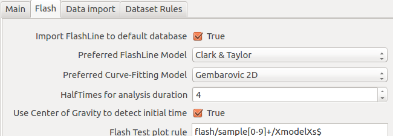

.. include:: ../substitutions.txt

.. _flash_options:
    
Global configuration preferences
======================================

|mf| offers few configuration options which will determine default plotting appearance, parameters population, and data import aspects. 

Options are contained into the general :ref:`preferences`, under the **Flash** tab:

Advanced options, related to default plots, are also listed. 

.. _opt_importToDb:

Import FlashLine to default database
--------------------------------------
	Default: True
	
FlashLine data will be compressed into an |m| file into default database location (usually MisuraData under user's home folder). 
If this option is false, the |m| file will be created into the same folder containing the FlashLine data - even if remote. 

.. _opt_model:

Preferred FlashLine Model
----------------------------------
	Default: Clark & Taylor
	
This option determines which model will be loaded to create default plots.
	
.. _opt_fitting:

Preferred Curve-Fitting Model
----------------------------------
	Default: Gembarovic 2D
	
The default curve-fitting model which |m| will attempt to plot when loading a test for the first time.

.. _opt_halfTimes:

HalfTimes for analysis duration
----------------------------------
	Default: 4
	
The halftime will be multiplied for this value in order to obtain the required thermogram time frame to perform a model fitting.

.. _opt_centerGravity:

Use Center of Gravity to detect initial time
---------------------------------------------
	Default: True
	
While importing FlashLine data, the center of gravity of the laser pulse is always calculated and saved. 
By enabling this option, any subsequent computation will use the center of gravity as the initial time of the test. 
By disabling it, the onset of laser pulse will be used instead.
	
.. _opt_plotHalfTimes:

Show HalfTime multiple on thermograms
------------------------------------------

	Default: 20
	
Each thermogram ("shot") is usually longer than needed. 
This options determines the maximum number of halftime multiples to plot on :ref:`model_plot` and :ref:`segment_plot`. 

