.. include:: ../substitutions.txt

.. _flash_interface:
    
Data Interface
================

This chapter offers additional information tailored at |mf| users, which might not be sufficiently covered in the general |m| documentation.

Flash data is organized in a highly hierarchical interface, designed to allow to both have a quick overview and dig deeper into every detail. 

- For each Sample (``S``), we have multiple segments or equilibrium temperatures (``T``):
- For each Equilibrium Temperature (``T``) we have multiple shots
- For each shot (``N``), we have:

  - raw thermogram, 
  - laser pulse
  - corrected thermogram
  - one or more curve-fitting results

- Each shot can be fitted against one or more models (``M``), with different model parameters each tim
- For each set of model parameters we have:

  - Fitting Results
  - Fitting Errors

So the hierarchy is: ``S/T/N/M``, or sample, temperature, shot, model. 

This structure is represented in the :ref:`navigator` tree:

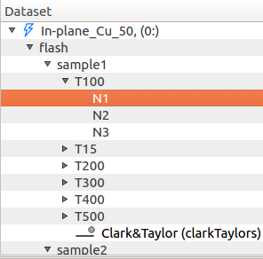

And in the global component's panel, from :menuselection:`Settings --> Global`:

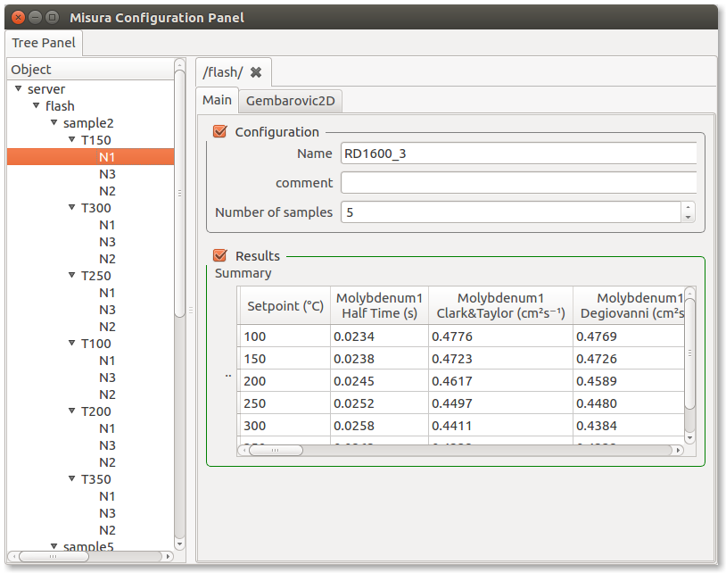

Each entry in those trees represents a component of the above hierarchy, 
and each component has several options representing either results or configurations. 

.. _flash_configuration:

Navigating configurations
--------------------------

|mf| tries to read most of the test information contained in the original test |fl| structure, except few debug outputs. 

The |fl| configuration dialog is reported here to better understand field mapping:

.. image:: _static/flashline_test_config.png 
    :scale: 50 %

This information is organized across |m| user interface elements. This paragraph helps locating most important metadata.

Most information is shown in the :guilabel:`Test Configuration` area.

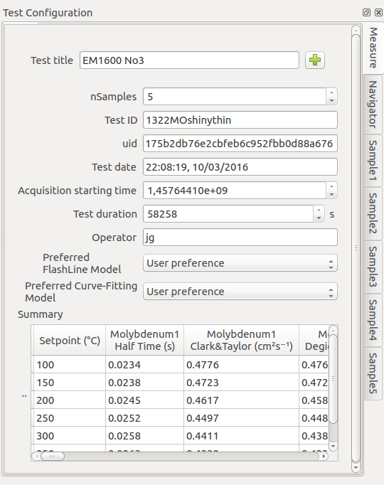

This area is divided into several tabs:

#. :guilabel:`Measure` tab contains global test information - eg, not specific to a single file.
#. :guilabel:`Navigator` tab contains :ref:`navigator` controls.
#. :guilabel:`Sample<N>` tabs, one for each ``<N>`` samples, contain data which is specific and potentially different for each signle sample.

.. _measure_tab:

Measure tab
^^^^^^^^^^^^^

Relevant :guilabel:`Measure` entries are explained below:    

.. list-table:: Measure tab mapping to FlashLine
   :widths: 15 15 15
   :header-rows: 1
   
   * - |m|
     - |fl|
     - Notes
   * - :guilabel:`Test title`
     - Same
     - 
   * - :guilabel:`Test ID`
     - Same
     - 
   * - :guilabel:`uid`
     - None
     - Automatically generated by |m| to uniquely identify the test
   * - :guilabel:`Test date`
     - :guilabel:`Date`
     -  
   * - :guilabel:`Test duration`
     - None
     - Total time elapsed from the start
   * - :guilabel:`Operator`
     - Same
     - 
   * - :guilabel:`Preferred FlashLine Model`
     - None
     - The preferred diffusivity value to be displayed in plots.
   * - :guilabel:`Preferred curve-fitting model`
     - None
     - The default curve-fitting model
   * - :guilabel:`Summary` table
     - None
     - A table listing all diffusivities, for all temperatures and all samples

.. _sample_tab:

Sample tabs
^^^^^^^^^^^^^

The sample tab is divided into two subsections: 

#. :guilabel:`Configuration` contains sample properties as entered by the user.
#. :guilabel:`Results`. contains diffusivity results.

|fl| displays sample properties in a table under the general test information. 
|fl| table columns are mapped here:

.. list-table:: Sample tab mapping to FlashLine
   :widths: 15 15 40
   :header-rows: 1
   
   * - |m|
     - |fl| column
     - Notes
   * - :guilabel:`Sample title`
     - Third, namesake column
     -
   * - :guilabel:`Position`
     - First, namesake column
     - Carousel position
   * - :guilabel:`Thickness`
     - Fourth, namesake column
     -
   * - :guilabel:`Diameter`
     - Fifth, namesake column
     -
   * - :guilabel:`Weight`
     - Last, namesake column
     - 
   * - :guilabel:`Test type`
     - :guilabel:`Specific Heat/Condictivity` global checkbox (bottom dialog).
     - Not all test types can be directly mapped to a |fl| interface element. 
       Some of them are global (eg: equal for all samples).
   * - :guilabel:`Sample ID`
     - Second, namesake column
     - 
   * - :guilabel:`Expansion type`
     - :guilabel:`Use Expansion` dialog
     - Type of expansion fitting function
   * - :guilabel:`Expansion reference`
     - :guilabel:`Use Expansion` dialog
     - Expansion reference data
   * - :guilabel:`Diffusivity Reference`
     - None
     - See :ref:`reference_data`
   * - :guilabel:`Specific Heat Reference`
     - None
     -
   * - :guilabel:`Density Reference`
     - None
     - 
     

     
.. _flash_results:

Navigating results
----------------------------

Configuration panels, tabs, sections, groups and options are introduced in the general |m| documentation about :ref:`components`.

A prominent role is played by **aggregates**. Diffusivities and associated errors are calculated for each shot and for each model run, in the (N) and (M) nodes above.
Parent nodes are informed of these results with a mechanism called *option aggregation*, explained in :ref:`option_aggregate`. 

In this way, each segment node (``T100``) can calculate and display the mean value across diffusivities of its shots (``N1``, ``N2``, ``N3``...):

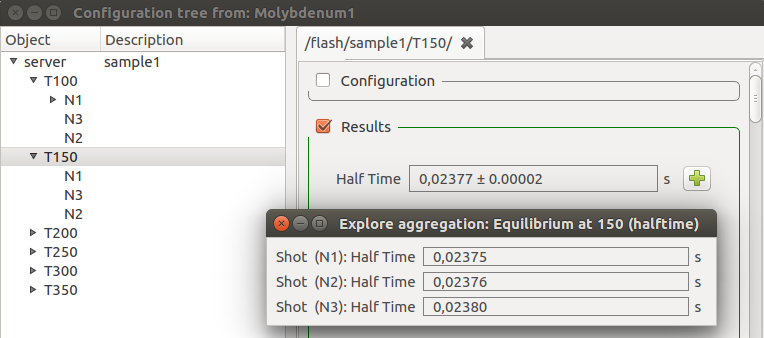
    
And a tabular representation, by shot temperature:
    
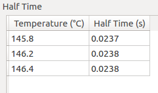
 
A sample (``S1``) can build a table with temperature-diffusivity mean from all its temperature segments (``T50``, ``T100``, ``T150``...):

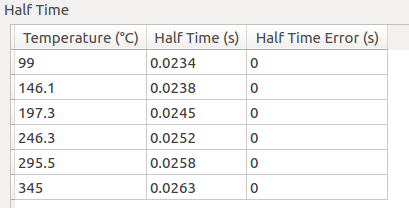

And the whole test can display a global summary table containing all values, from all samples (``S1``, ``S2``, ``S3``...).

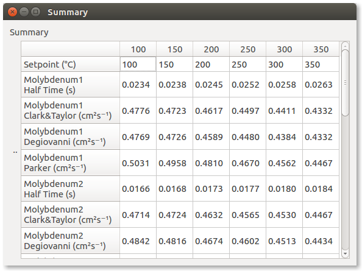

.. _reference_data:

Loading reference data
^^^^^^^^^^^^^^^^^^^^^^^^^

Standard reference materials can be defined for each sample, in the **Sample N** right panel.  

If all samples have the same reference, it can be defined just on time.

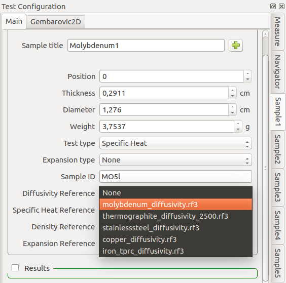

After a selection is made, new output tables and values will be generated in each sample, segment and shot, containing reference data.

New reference datasets will also appear in the :ref:`navigator` under the sample and segment nodes, 
so they can be plotted by double-clicking or right-click then **Plot**.

.. _summary_plot:

Summary Plots
---------------

When a test is opened, a *summary* plot will display Clark&Taylor diffusivities with temperature, for all samples. 
The diffusivity method can be changed by setting :ref:`opt_model` to any supported technique.

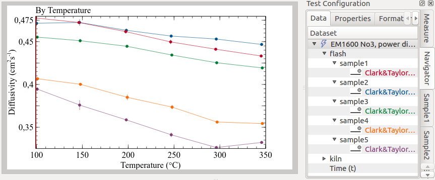
 

Other summary plots can be created from the navigator, by double-clicking on supported nodes, or right-click and selecting the associated plot action. 

The following animation illustrate the process of creating the default plots as hereafter explained:
 
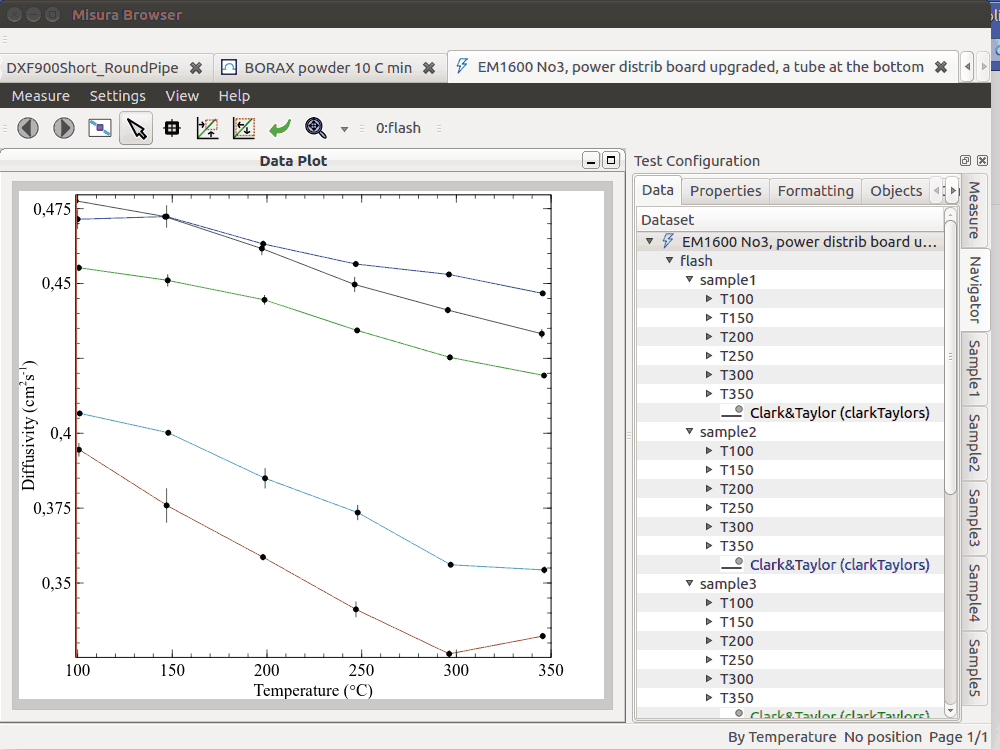

.. _sample_plot:

Sample Plot
^^^^^^^^^^^^
By selecting **Sample Plot** or double-clicking on a sample node, a new plot will be created with diffusivities by temperatures of the selected sample.

It will additionally display point clouds around each mean diffusivity value, representing the diffusivity obtained from each shot.

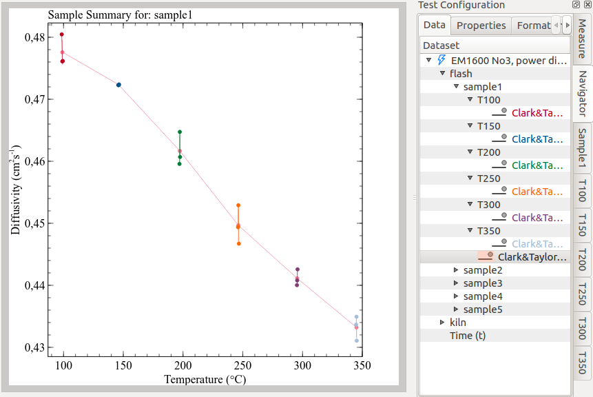
    
.. _segment_plot:

Segment Plot
^^^^^^^^^^^^^
A **Segment Plot** will overlap thermograms from all shots contained in a segment. 

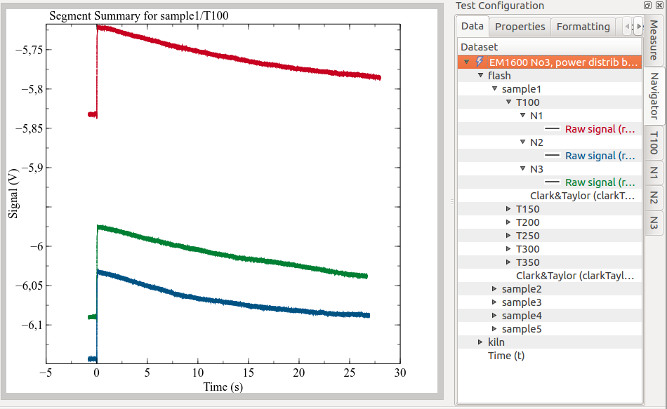

.. _shot_plot:

Shot Plot
^^^^^^^^^^
The **Shot Plot** simply displayes the thermogram.

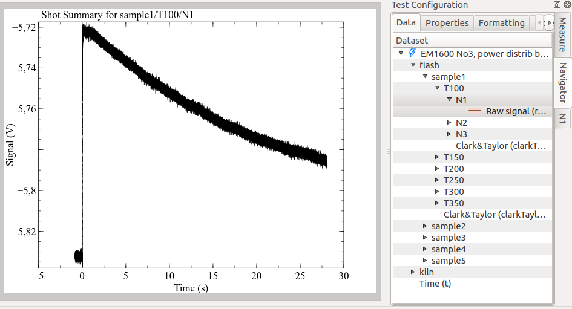

.. _model_plot:

Model Plot
^^^^^^^^^^^
Any curve-fitting model can create a **Model Plot**. The page is splitted in two sub-plots:
the upper part shows the thermogram and model output; the lower part shows the residuals.

.. image:: _static/plot_model.png 
    :scale: 70 %

In case of model re-run, this model will only partially update. It is preferrable to re-create it from zero, 
from the :menuselection:`Model Plot` action in the navigator.

.. _model_plot_tabs:

Dynamic :guilabel:`Test Configuration` tabs
------------------------------------------------

As the current plot changes to display data from different samples, segments and shots, 
the vertical tabs in the :guilabel:`Test Configuration` load relevant component's information.

The default :ref:`summary_plot`, for example, displays diffusivity curves for all samples. 
The :guilabel:`Test Configuration` accordingly lists one configuration tab for each sample.

A :ref:`sample_plot`, plotting data from one sample and multiple segments, will show both relevant sample's tab, and one tab for each segment.

With the same logic, :ref:`segment_plot` offers the loaded segment tab plus one tab for each shot, 
and the :ref:`model_plot` both the shot tab and the model output tab where model configuration and results are saved (for example, :guilabel:`gembarovic`). 

.. _plots_board:

Plots Board 
------------

Plots are organized as pages of a document. Pages can be browsed with the blue left/right arrows on the upper plot bar. 

When many plots are created, navigation can become quite confusing. The :guilabel:`Plots Board` and the breadcrumbs navigator
allow to view and manage plot pages in a hierarchical way.

The plots board displays pages screenshots side-by-side, as a plain list. 
But not all pages are displayed at once: only those sharing the same hierarchical level. 

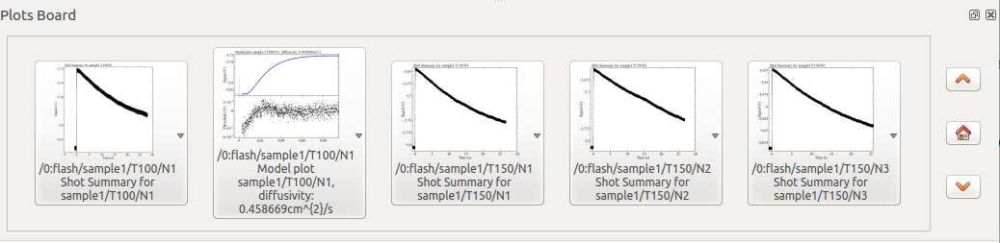

All sample plots will be listed together, as well as segment plots or shot plots, but they will never mix. 
The example shows numerous shot plots, and a model plot (classified at the same hierarchical level as shots).

By left-clicking on a plot screenshot, it will appear in the main plot window. 

If the left mouse button is kept pressed, a context menu will appear, allowing to:

- Explicitly **Show** (the same as single click) 
- **List all children**: will show only plots containing curves which are dependent from those contained in this plot. 
  For example, if only children of a sample are selected, only plots from that sample's shots will be listed.
- **Delete** the plot page
- **Export** the page to pdf

The board also shows three buttons:

- **up** and **down** arrow, to navigate in the hierarchy levels
- *home*, to reset all selections and display the root level

The following animation illustrates the plots board in action. Notice also as the :ref:`breadcrumbs` updates accordingly.

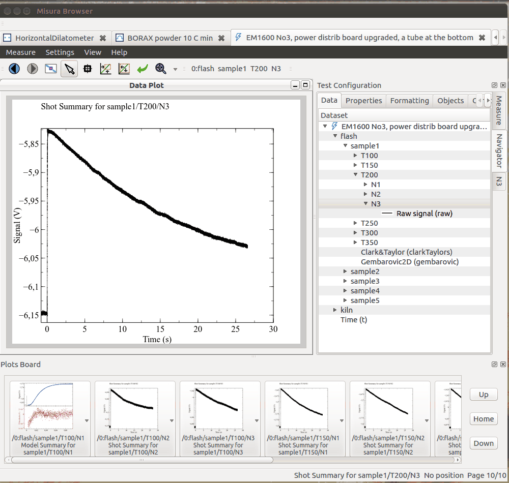

.. _breadcrumbs: 

Breadcrumbs 
------------

It appears as a simple sequence of labels, representing the current hierarchical level. 
Each label can be clicked and gives access to any other plot page in that hierarchical level.

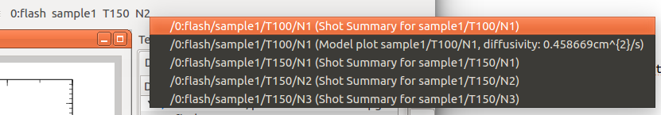

The principle of the breadcrumbs is similar to the plots board, except that it does not include screenshots and can only switch to the selected page, 
with no additional actions like delete etc.

