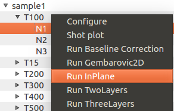
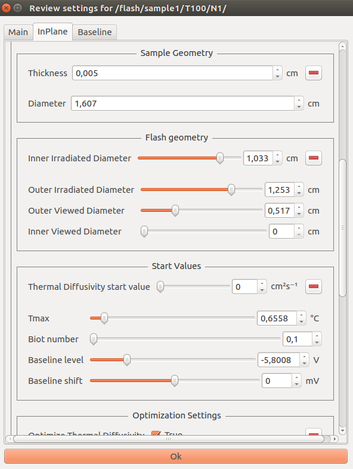
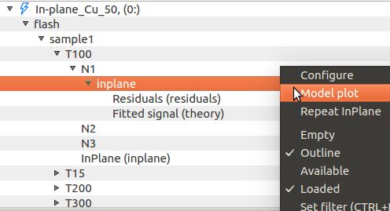
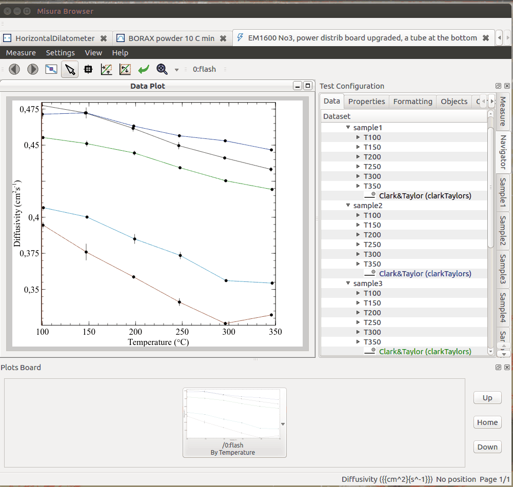
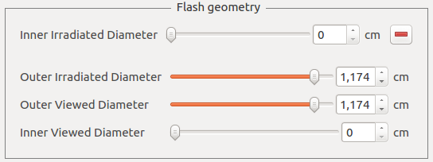
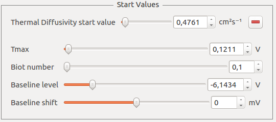
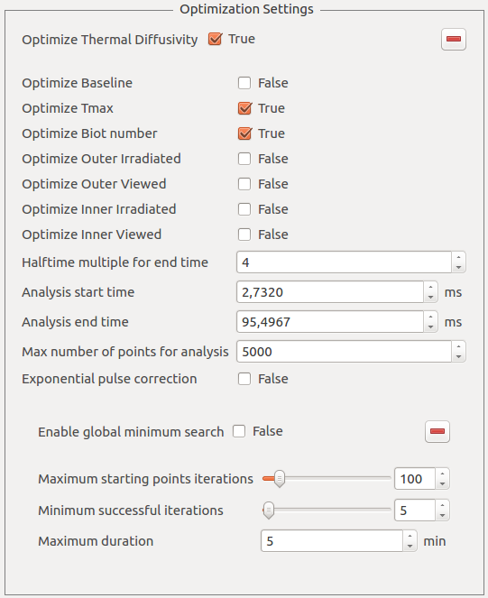
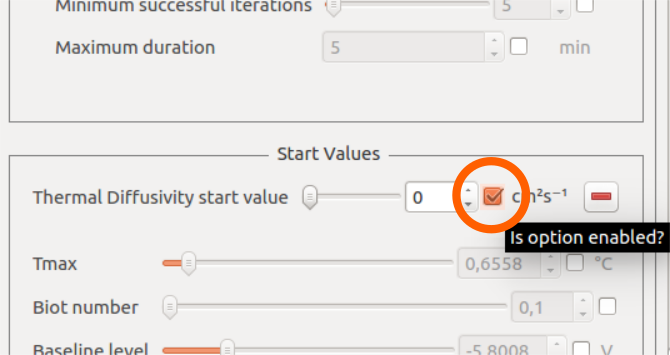
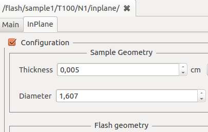

.. include:: ../substitutions.txt

.. _models:
    
Flash Models
===================

Fitting models from the Navigator
-------------------------------------

Flash post-processing actions are currently accessible from the :ref:`navigator`. 
The Navigator represents all the data contained in one or more test runs as a hierarchy of *nodes*. 
Usually the tree has only one root node, corresponding to the opened test. 

Right clicking on a node gives access to specific actions, including those related to Flash models.

Child nodes might represent:

- A :ref:`component<components>`. Samples, segments, shots are componets. 
  The component configuration can be accessed via right-click and ``Configure`` action.
- A dataset, which can be plotted, manipulated and edited.

The root node always has a ``kiln`` sub-node, containing information and sub-nodes related to thermal control, and a ``flash`` sub-node. 
The ``flash`` sub-node always contains `measure` sub-node, with general test configurations (name, number of samples, instrument serial number, etc)
and :ref:`option_aggregate` summarizing all diffusivity results. 
The ``measure`` node :ref:`panels` is usually displayed in the right interface area (*Test Configuration*).

The ``flash`` node also presents one ``sample<N>`` node for each sample in the test (eg: ``sample1, sample2, sample3...``). 

Samples have one segment sub-node for each equilibrium temperature. 

The general procedure to execute models or related calculations is:

- Select the navigator node which will be subject to the desired action.

.. image:: _static/node_select.png 
    :scale: 50 %

- Right-click on the node. The node context menu will appear.
- Select the model to run (`Run ...`).

- If the model has options, a dialog box will allow the user to inspect and modify default model parameters through a :ref:`panels`.

- As the model parameters are confirmed by ``Enter`` keystroke or by clicking the ``Ok`` button on the bottom of the dialog, computation starts.
- The output of the calculation will be shown in the navigator in the form of additional sub-nodes, containing results.
- Additional actions can be performed on the model output node (plotting according to a template, re-running the model, etc).

When the clicked node represents a single shot, the model is fitted against that shot thermogram.
If parent nodes are clicked, for example a segment node or a sample node, a recursive execution will be performed. 

Model dialogs contain some common groups of options, which are generally explained in the following sections. 
Presets or equivalent values from other nodes of the test can be loaded with the mechanism explained in :ref:`option_group`.
More details are included in each model's section.

The following animation illustrates the process of executing :ref:`model_gembarovic` on a single shot:

.. _model_sample_geometry: 

Sample Geometry
^^^^^^^^^^^^^^^^

.. image:: _static/sample_geometry.png
	:scale: 50 %
	
This section contains basic geometric information pertaining the sample itself and, for multi-layer tests, the sample holder. 
They are pre-filled with values obtained from the sample description before starting the test, and are equal for each shot in the test.
The user can anyway experiment an change them. 

.. _model_flash_geometry:

Flash Geometry
^^^^^^^^^^^^^^^

	
These options are related to the optics of the flash apparatus. 
They should be configured according to the hardware calibration, but they can also be used as an initial guess to be optimized.

.. _model_start_values:

Start Values
^^^^^^^^^^^^^^

	
Fundamental model parameters. They must be as close as possible to the *real* solution. 
|mf| will guess optimal values based on legacy diffusivity models and gross properties of the shot.

.. _model_optimization:

Optimization Settings
^^^^^^^^^^^^^^^^^^^^^^^

This section allows to enable or disable the optimization of each individual parameter, through a series of **Optimize <name>** boolean options.

Moreover it allows to finely tune which region of the shot will be used as the target for the curve-fitting:

- **Analysis start time** and **Analysis end time** allow to define the analysis temporal window in milliseconds. The start time might be useful to cut interferences
  due to the energy burst. The end time allows to discard excessive amount of data, which is unuseful and sometimes even detrimental.
- **Halftime multiple for end time**:  This option allows to define the end time relative to the halftime of the shot. 
  This is the preferred way to set the end time. The default is configured in :ref:`opt_halfTimes`. 
- **Max number of points for analysis** defines the maximum number of points which will be used to perform the curve-fitting. 
	If the selected shot range includes more points, an even selection of them will be dropped until this condition is satisfied.
	
Each model might include additional, specific optimization options.

.. _model_constraints:

Optimization constraints
~~~~~~~~~~~~~~~~~~~~~~~~

During the curve-fitting procedure, model parameters are being varied according to mathematical criteria 
in order to minimize the error between the model and the thermogram.

As models are quite complex equations, they will always offer many solutions. Most of them might have no physical meaning, while some are impossible given 
additional knowledge about the material generating the thermogram.

It is thus advisable not only to set the :ref:`model_start_values` and :ref:`model_flash_geometry` to reasonable values, but also check that parameter's ranges are
plausible given other material's property.
 
Ranges are accessible by right-click on the option's label, then enter the :ref:`option_range_menu`, and edit minimum/maximum values. 

.. _model_minimization: 

Minimization algorithm
~~~~~~~~~~~~~~~~~~~~~~~

The optimal parameters which best approximate any model to real data will be searched via an error minimization algorithm.

This kind of search is highly dependent on initial conditions: if they are a good approximation of the *best* solution, the search will be fast and successful. 
Otherwise it will take longer time and the risk of finding a local minimum with little or no physical sense increases.

|mf| offers some help in this area:

- An initial guess will be attempted from legacy diffusivity models (Clark&Taylor) and from gross mathematical properties of the shot.
  It's up to the user to review and refine this guess. 
- As seen above in :ref:`model_optimization`, the user can restrict the search only to relevant, unknown parameters.
- Parameters being optimized should define :ref:`model_constraints`. The algorithm will not be allowed to wander off this range. 

The default optimization algorithm is `ODRPACK`_, orthogonal distance regression. 
It will work most of the times and give a good result but, because of it's *local* nature, 
it will usually require that the initial guess is not too far from the solution.

When the initial guess is still giving unreasonable results, a global search can be attempted using a modified `Basin Hopping`_ algorithm. 
It creates multi-dimensional grid of starting values and attempt an ODR local search from a random selection of points. 
It will try until a good fit is found, the grid is completed or the search times out.  

Basin Hopping options are:

- **Enable global minimum search**: activate Basin Hopping. 
- **Maximum starting points iterations**: maximum number of iterations from the initial starting grid
- **Minimum successful iterations**: iterations needed to decide if a local minimum can be considered global and the search ended
- **Maximum duration**: after this timeout expired, the search will be ended and the best result selected

.. _recursive_models: 

Recursive Model Run
---------------------

Recursive model run can start from a segment, sample or test (root) node. 
It will fit all thermograms contained underneath the starting node with the selected model.

Before starting the recursion, a dialog box allows the user to specify model parameters 
and decide if they should be forced to some fixed value or calculated for each thermogram.

At each thermogram the algorithm will use the default sample geometry and optimization settings. 
It will also try to guess the starting values for the fitting procedure, as well as the time frame 
for the analyis (based on the :ref:`half times option <opt_halfTimes>`). 

This behavior can be overridden by forcing any option into a fixed value in the model configuration dialog, via the *enabled* checkbox.

	
When a configuration option is enabled before a recursion, it means its value will be fixed for all shots encountered during the recursion. 
When disabled, it means a default value will be used if available, or a custom value will be calculated based on thermogram features (for example: Tmax). 

.. _model_results: 

Analyzing results
--------------------

Results are mainly stored into dedicated *output nodes* in the :ref:`navigator`. 
Each output node descends from the shot containing the thermogram which was used to generate it.

By right-clicking on an output node, it is possible to:

- :guilabel:`Configure`: Access configurations and results by opening a new :ref:`panels`.
- :guilabel:`Model Plot`: Create a default plot out of the model results (:ref:`model_plot`)
- :guilabel:`Repeat` the model execution. This action will not display the model dialog and will proceed silently

The output node configuration contains a copy of the starting parameters which were used to perform the model fitting. 
The panel is divided in two tabs: *Main*, containing just node and model name, and a section with the same name of the model (eg: InPlane), 
containing all model parameters *and* fitting results.

After running an analysis, output results are automatically :ref:`aggregated in result tables <option_aggregate>`.

.. _model_refit:

Repeating a model fitting
-----------------------------

Fitting real data against complex theoretical models sometimes requires trial and error. 
It is advisable to always try curve-fitting on few shots, then use the same parameters for few segments, 
and finally extend to the entire sample or the whole test.

|m| offers different ways to repeat an optimization. 

#. A navigator context-menu action :menuselection:`Repeat`, available from the model node, allows to silently repeat the fitting.
#. The optimization configuration dialog can be recalled from the shot node, using the corresponding :menuselection:`Run model <M>`.

.. _model_gembarovic:

Gembarovic Two Dimensional Model
----------------------------------

The Two Dimensional model, named after Jozef Gembarovic, takes into account optical details - like viewed and irradiated diameters, 
heat diffusion through the sample area and the exponential shape of the pulse.

.. image:: _static/jg2d.png
	:scale: 50 %

Additional parameters include, under **Flash Geometry**:

- **Outer irradiated diameter**: the diameter illuminated by the energy source
- **Inner irradiated diameter**: an optional *blind spot* in the middle of the energy source
- **Outer viewed diameter**: the diameter viewed by the detector
- **Inner viewed diameter**: an optional **blind spot** which is not detected, in the center of the viewed circumference

These parameters can be individually enabled for optimization in the :ref:`model_optimization` group.

This model additionally supports **Exponential pulse correction**, if enabled and correctly fitted on the laser pulse. 

.. _model_inplane:

In-Plane Model
-------------------

The In-Plane model takes similar parameters as the Gembarovic Two Dimensional model, but with a different meaning.

Here we assume the sample is so thin, or heat diffusion is so fast, that through-thickness transmission is negligible. 

Irradiated diameters are configured to create an outer doughnut, containing the viewed area after a circular section which is neither irradiated nor viewed.
In other words, the outer viewed diameter **must** be smaller than the inner irradiated diameter by some margin, 
as this margin is used to calculate the diffusivity.

.. image:: _static/inpl.png
	:scale: 50 %

The thermogram is thus the result of diffusion through this blind area of the sample.

This model does not support exponential pulse correction. 

.. _model_multilayer:

MultiLayer Model
-------------------

This method is divided in two actual models, for **two** and **three** layers. 

Additional options:

- **Sample Geometry** group shows two or three **Thickness** values (``Thickness (1)``, ``Thickness (2)`` and for three layers also ``Thickness (3)``).
- **Start Values** group lists additional entries for each layer (n) **Density (n)**, **Specific Heat (n)**, **Heat Loss (n)**. 
- For two layers only, **Start Values** also allows to configure the **Thermal contact resistance** between the first and the second layer.
- Each option listed in **Start Values** is also listed in :ref:`model_optimization`, so it can be optimized during the curve-fitting procedure.
 
.. _ODRPACK: http://www.netlib.org/odrpack/
.. _Basin Hopping: https://docs.scipy.org/doc/scipy/reference/generated/scipy.optimize.basinhopping.html
