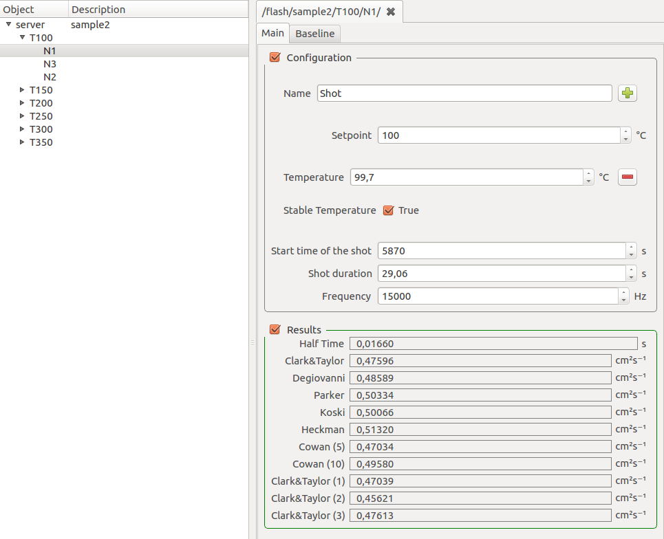
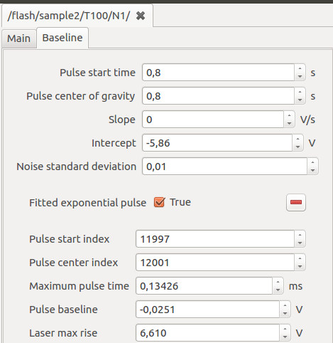
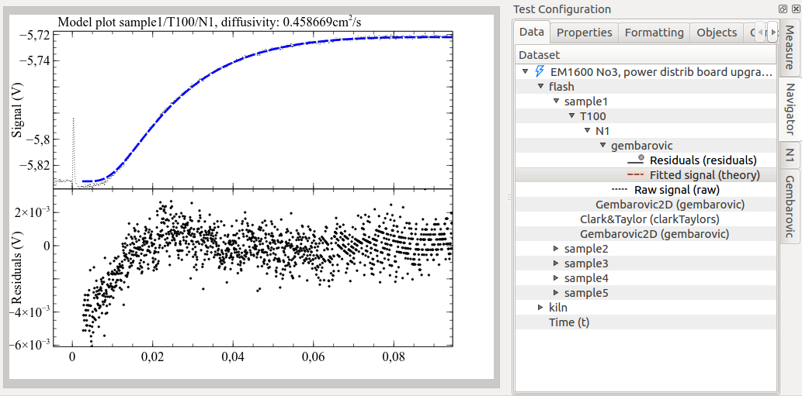

.. include:: ../substitutions.txt

.. _quickstart_flash:

Quickstart
============

This step-by-step guide will explain all actions required to:

#. import a |fl| data folder into |m|, 
#. review and plot the results, 
#. configure and run a curve-fitting model.

From FlashLine to |mf|
----------------------------

|mf| needs to convert and compress a |fl| test folder into a single :term:`HDF5` file in order to elaborate it. 

#. Open the :ref:`browser` by double-click on :program:`browser.exe`.
#. Locate the :ref:`datasources` sub-window, under the first :guilabel:`Databases` tab.
#. Click on the :guilabel:`Import` button under the :guilabel:`Recent files:` column. 
#. Navigate to the :file:`TestInformation.xml` file, located in the root of your |fl| test folder, and click :guilabel:`Open`.
#. The import process will require some minutes, depending on the speed of your computer,
   disk and network connection if the file is remote. The progress will be indicated by a dialog window containing a progress bar.
#. After the import finishes, the file will be opened in a new tab, named after the title of the test.
#. The default :ref:`summary_plot` is shown.

More details on these steps, and alternative ways of importing files, can be found in the :ref:`flash_data_import` section.

Test properties
^^^^^^^^^^^^^^^^^

Most |fl| properties are mapped into |m| components, accessible through interface elements.

#. Locate the :guilabel:`Test Configuration` right-area.
#. Identify lateral vertical sub-tabs on the right and activate the :guilabel:`Measure` tab.
#. Observe as the :guilabel:`Test title` and :guilabel:`Test ID` corresponds to your original |fl| test.
#. Activate the :guilabel:`Sample 1` tab and check that :guilabel:`Sample title` and :guilabel:`Sample ID` 
   are correctly reported from the |fl| test.

For more details and a mapping between |fl| and |m| fields, please read :ref:`flash_configuration`.

FlashLine results
^^^^^^^^^^^^^^^^^^

#. Activate the :guilabel:`Measure` vertical sub-tab on the right of :guilabel:`Test Configuration`.
#. The last entry is :guilabel:`Summary`. This is the grand-summary of all diffusivities contained in the test.
   It is thus quite complex to navigate.
#. Right-click on the :guilabel:`Summary` and select the :menuselection:`Detach` action.
#. The same table will open in a new, enlargeable table. Column headers contain the sample name and the diffusivity type.
#. Right-click on the header and select :menuselection:`Rotate` for a more confortable view. 
#. Read :ref:`option_table` for more controls.

Numerous partial tables are contained in :guilabel:`Sample <N>` tabs.

#. Activate :guilabel:`Sample 1` tab. Deactivate the :guilabel:`Configuration` section checkbox. The :guilabel:`Results` section will remain active.
#. Locate the :guilabel:`Half Time` table by scrolling through the panel.
#. Right-click on the second cell (:guilabel:`Half Time (s)`) of the first row.
#. From the context-menu, select :menuselection:`Equilibrium at <X> (T<X>)` (where ``<X>`` is the temperature of the segment). 
#. Select menu action :menuselection:`List aggregated options`.
#. Review diffusivity from each single shot at the selected temperature. Each shot contributes to the mean value 
   displayed in the column cell from which the context menu popped out.

The component's tree can be reached anytime also by right-click on vertical tabs labels' of the :guilabel:`Test Configuration` area.

#. Right-click on :guilabel:`Sample 1` tab label.
#. Select :menuselection:`Configure`.
#. A new window will open, displaying the configuration tree spawning from ``Sample 1`` component.
#. Expand any :guilabel:`T<X>` node on the left tree (where ``<X>`` stands for the temperature of the segment).
#. Double-click on a :guilabel:`N<Y>` leaf node (where ``<Y>`` is the shot number). 
#. Individual shot information will appear in the right area.

Important shot information, contained in the :guilabel:`Configuration` section, are:

- :guilabel:`Setpoint`, the target temperature of the segment
- :guilabel:`Temperature`, the actual temperature recorded at the beginning of the shot.

  - :guilabel:`Stable temperature` sub-option can be activated by clicking on the :guilabel:`+` button. 
    Tells if temperature value was stable enough.

- :guilabel:`Shot duration` and :guilabel:`Frequency`

The :guilabel:`Results` section contains all diffusivity results.

Shots contain also a :guilabel:`Baseline` tab containing baseline information.

     
- :guilabel:`Pulse start time` calculated at the onset of laser pulse
- :guilabel:`Pulse center of gravity` calculated in the center of gravity of laser pulse (:ref:`opt_centerGravity`)
- :guilabel:`Slope` and :guilabel:`Intercept` determine detected baseline linear regression
- :guilabel:`Fitted exponential pulse` checkbox indicate if the laser pulse could be successfully fitted with an exponential function

Plotting
^^^^^^^^

The navigator is the most explicit way of performing plotting operations.

#. Activate the :ref:`navigator` vertical tab in :guilabel:`Test Configuration` area. 
#. It is divided into :guilabel:`Data`, :guilabel:`Properties`, :guilabel:`Formatting` and optionally more horizontal tabs. 
   Ensure the :guilabel:`Data` tab is active.
#. Right-click on :guilabel:`sample1` node of the tree. Tree nodes can also be addressed by their full path: ``/flash/sample1``.
#. Select :menuselection:`Sample Plot` context-menu action.
#. A :ref:`sample_plot` is created and displayed.

Default plots can be generated also by directly interacting with currently plotted curves.

#. Right-click on a point-cloud representing the individual shot values for a temperature.
#. Select the :menuselection:`Node` submenu. Notice as this shows exactly the same actions as 
   if you clicked on the corresponding :guilabel:`T<X>` node on the navigator.
#. Select the :menuselection:`Segment plot` action, which will generate a thermogram overlap plot 
   for the selected temperature segment (:ref:`segment_plot`). 
#. Now right-click on any thermogram, select again :menuselection:`Node --> Shot plot`.
#. This will display the shot plot alone.

Zooming
~~~~~~~

Most common task on a shot plot is zooming in and out. There are several ways.

#. Click on the |zoomin| toolbar button.
#. If you now hoover on the plot, mouse icon will be a sort of cross.
#. Click on any point of the plot, then keep the left mouse button clicked and draw the rectangle you would like to zoom into.
#. When you release the mouse, axes ranges will adjust in order to visualize only the selected rectangle.
#. Click on the left-most white arrow to exit from the zooming tool.
#. Click on |zoomout| toolbar button to reset all axes ranges to automatic.

Another method is by selecting an ax, then use the internal black square handles to move the ax range wherever you like.
Instead, if you need to precisely set axes ranges:

#. Select the ax.
#. Activate :guilabel:`Navigator` vertical tab in :guilabel:`Test Configuration`, then :guilabel:`Formatting` horizontal tab. 
#. Set :guilabel:`Min` and :guilabel:`Max` according to your needs.

Browsing plots
~~~~~~~~~~~~~~~~

Generated plots can be considered as *pages* of a larger document. Each time a plot is generated, a new page is added to the document.
To browse document's pages, you can click on |pageprev| |pagenext| arrows on the toolbar.

After many plots are created, it might become cumbersome to navigate through them.

The :guilabel:`Plots board` area keeps an organized view of all plots generated in the current document.

#. Generate all sample plots, by double-click on all sample nodes in the navigator tree.
#. The board still shows only a screenshot of the initial overview plot, because it is showing the root level of the hierarchy.
#. Click on the down arrow in the right area of the board. The board fills with all the sample plots generated before.
#. Click on a sample plot screenshot. The corresponding plot will be loaded in the main plot area.
#. Now generate some shot plots by double clicking on shot nodes in the navigator.
#. Navigate one level down with the plots board's down arrow.
#. All generated shot plots are listed.
#. Now click the up arrow to navigate in the upper level of the hierarchy.
#. Click the home button to go straight to the root level.
  
Learn more in the :ref:`plots_board` section.

Calling a curve-fitting model
---------------------------------

#. Right-click on a shot node on the navigator.
#. Select the curve-fitting model you would like to run (eg: :menuselection:`Gembarovic 2D`).
   The model runner dialog will pop up in a new window.
#. Configure the :guilabel:`Flash Geometry` and :guilabel:`Start Values`.
#. Click :guilabel:`Ok`.
#. Models can take minutes to run. A progress bar dialog will keep you informed about the approximative progress.
#. When the execution ends, **a new node** will appear in the navigator, as a leaf of the shot node starting the calculation.
#. The node is named after the model, eg: :guilabel:`gembarovic`.

Learn more in :ref:`models`.

Model plot
^^^^^^^^^^^

#. Locate the output node generated by the model run and right-click on it.
#. Select :menuselection:`Model plot` action.
#. The model plot will appear in a new document page.

    
Learn more in :ref:`model_plot`.

Viewing the results
^^^^^^^^^^^^^^^^^^^^

Model run results are always repeated in two components (or navigator nodes): the model's output and the shot. 
These are visible as |tcfg| vertical tabs when the :ref:`model_plot` visible.

Both node and shot configuration panels display an additional horizontal tab titled after the model (eg: :guilabel:`Gembarovic2D`), after the :guilabel:`Main` tab.

The :ref:`Main` tab of the shot panel shows an additional field named after the model's diffusivity output.

New model's diffusivity tables are added to the parent segment and to the sample, collecting the only one diffusivity point we calculated. 

Learn more in :ref:`model_results`.

                      

                      

                      
