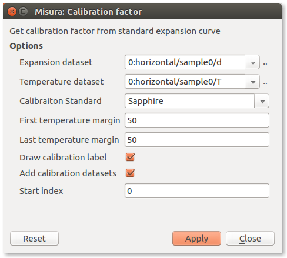
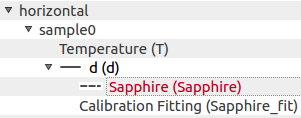
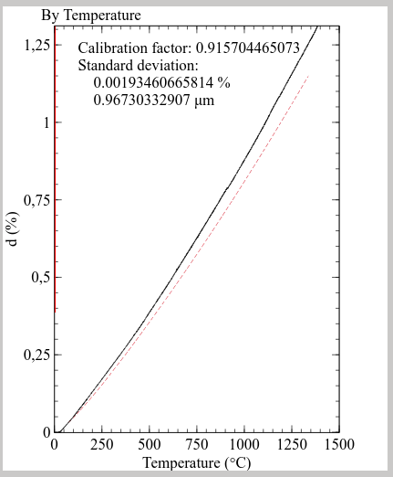

.. include:: ../substitutions.txt
.. |smp| replace:: ``Horizontal Dilatometer Sample File 1.h5``
.. |smprep| replace:: ``Horizontal Dilatometer Sample Report 1.pdf``
.. |instr| replace:: ``horizontal``
.. |instrn| replace:: Horizontal Dilatometer

Quick Start: Browsing an |instrn| file
======================================
This Demo will guide you through the data analysis of an |instrn| output file. 

.. include:: ../browser/quickstart/opening.txt
.. include:: ../browser/quickstart/config.txt

==============================
Interacting with the Data Plot
==============================

The :ref:`navigator` tree is the gate to the most important actions you can perform on the data plot. 

In order to plot one more dataset (for example the temperature setpoint):

#. Right-click on the dataset you wish to plot on the Navigator tree (``/kiln/S``). 
#. Select the **Plot** action from the context menu.

The same apply for removing a dataset and all its related objects from the plot. The Plot action will be checked if the curve is visible, unchecked if not visibile.

The setpoint curve plot is now referred to its own axis labelled *S (°C)*. To better compare temperature and setpoint, it is useful to refer the setpoint plot to the temperature axis:

#. Right-click on the setpoint curve on the Data Plot window. Select **Properties** from the context menu. 
#. A new dialog window opens, listing all the properties of the plotted curve. Search for the bold **Y axis** entry. 
#. Change **Y axis** from **ax:S** to **ax:T**. The curve will be immediately referred to the *T (°C)* axis.

The *S (°C)* axis loses its scale (it's now from 0 to 1). It's no longer useful, so you can hide it: 

#. Right-click on the *S (°C)* axis, select **Properties**. 
#. The first entry is **Hide**. Check the checkbox. The axis disappears.

You can freely move any axis by clicking on it and dragging.

--------------------------------
Viewing dilatation as Percentile
--------------------------------
The ``/``\ |instr|\ ``/sample0/d`` dataset represents dilatation. It is recorded in microns, but is frequently useful to analyze it as a percentile of the total initial length of the sample. The initial length was measured with a manual digital micrometer, and set before starting the test.

Follow these steps to convert the curve to percentile:

#. Locate the ``d`` (``/``\ |instr|\ ``/sample0/d``) element in the Navigator tree under Results tab. 
#. Right-click and select **Percentile**. 
#. A dialog will appear. Click **Apply**. 
#. A new temporary label in the dialog confirms the dataset was created (Done). Click **Close**. 
#. If the curve is currently plotted, you immediately view the effect in the graph.

It may happen that the operator forget to measure the sample, or inserts a wrong initial dimension. If the thermal treatment modify the structure of your material, the test must be repeated. In case you are able to recover the correct intial dimension, or you are confident that you can measure it after the test run, you can change its value.

#. Locate the ``d`` element in the Navigator tree. 
#. Right-click and select **Set Initial Dimension**. 
#. Insert the correct value in **Initial dimension value**. 
#. De-select *OR, automatic calculation based on first points* checkbox. 
#. Click **Apply** then **Close**. 

If the curve is currently plotted in percentile, you will se the axis scale changing accordingly to the new initial dimension set.

---------------------------------------
Evaluating the Coefficient of Expansion
---------------------------------------
The coefficient of expansion is calculated from the ``d`` dataset, the initial dimension and the temperature. To create the coefficient curve:

#. Locate the ``d`` element in the Navigator tree. 
#. Right-click and select **Linear Coefficient**. 
#. Click **Apply** and **Close**. 
#. The Navigator tree is updated. The ``d`` element now has a child: *Coefficient(T,d)*. This is the coefficient of expansion. 
#. Plot the coefficient dataset using its context menu.

The curve will be referred to a new axis *Coeff(50)*. The number 50 in the label means the coefficient was calculated starting from 50°C. 
The scale of the axis will be around 10\ :sup:`-6` - 10\ :sup:`-5`. You can rescale the axis to a more comfortable multiplier:

#. Right-click on the *Coeff(50)* axis. Select **Properties** action. 
#. Locate the **Scale** entry and set it to 1e6. 

Now the scale of the axis should go from 2.5 to 12.5, where the multiplier is 10\ :sup:`-6`. 

---------------------------------------
Calibrating with a known standard
---------------------------------------
By comparing the measured expansion curve of a standard material with theoretical values, it is possible to calculate a **calibration factor** 
which can then be applied directly during the measurement. 
The calibration factor will be multiplied by the observed expansion, acting as a slope correction on the whole expansion curve. 

If the factor is less than one, it means the measured curve of the standard material was higher than the theoretical, so all measurements will be reduced by that number. 
In case the factor is greater than one, it means the measurement was lower: all subsequent measurements will be increased accordingly.

To execute the calibration tool, open the test in the Browser or Graphics, then:

#. Locate the ``d`` element in the Navigator tree. 
#. Right-click and select **Calibration**. 
#. Select the **Calibration standard**, start/end temperature and display options.
#. Click **Apply** and **Close**. 

When launched through this sequence, the calibration plugin dialog will show pre-filled fields for *Expansion dataset* and *Temperature dataset*:

Other options include:

- **Calibration Standard** chooser contains a list of materials having certified expansion curves.
- **First temperature margin** determines the temperature interval to discard from the start of the test. 
  When the test starts, thermal control might induce imperfections in the heating rate, due to furnace inertia. 
  This options allows to ignore the initial part of the curve.
- **Last temperature margin** allows to discard a temperature interval at the end of the test.
- **Draw calibration label** will create a text label on the currently selected plot page, and output the calibration factor and standard deviation.
- **Add calibration datasets** will add the theoretical expansion values and a polynomial fit of the measured values to two child datasets. 
  Those curves can later be plotted.
- **Start index** allows to skip initial points by index (second) - alternative to *First temperature margin*

Example navigator tree after the creation of calibration datasets:

Example calibration plot with calibration label and plotted standard:

The calibration factor can then be copied from the label and configured in the :menuselection:`Settings --> Instrument panel` under ref:`live_acquisition`. 

This procedure works both on native |m| tests and on imported Misura3 tests.
