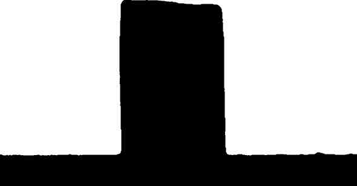
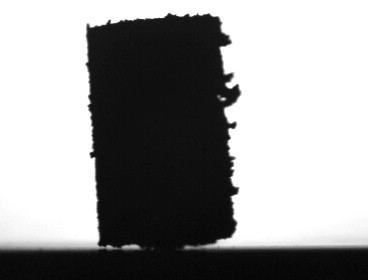
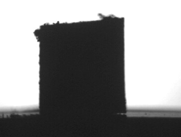
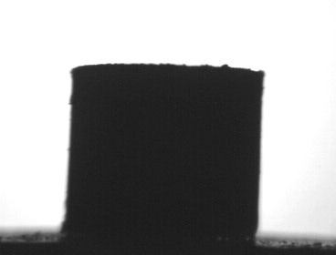
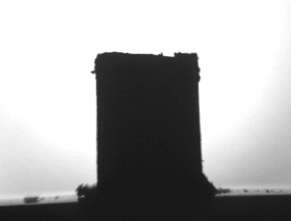
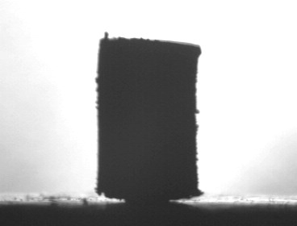

.. include:: ../substitutions.txt
 
.. _microscope_sample_preparation:

Sample preparation for the Heating Microscope  
==============================================

The shape of the sample and the change in outline are very important for recognizing the fundamental points. The sample should be made with the correct tools and be of the correct dimensions.  You should also avoid carrying out tests on samples with particular imperfections, such as those described and illustrated below.  

The preparation of a test consists of a series of manual procedures by which you make a test sample, put it in the kiln, focus the image and make the initial observation of the silhouette (to avoid acquiring unreliable data).

The rectangular base and the pressing tool are designed for preparing a sample of the correct dimensions, where the diameter of the base of the cylinder is 2/3 of the height.  Keeping these proportions is very important as the analysis of the images works on the basis of this relationship.  The best dimension is 2mm in diameter by 3mm in height.  To make a sample you should put a small amount of body on the metal part of the base, beside the holes.  

1. The powder should be dampened with water (distilled if possible), to form a composite which is cohesive enough to ensure compactness, without sticking.  The material should be dampened just enough for it to hold its shape. If it is too dry it will break when it is being transferred to the plate.  If it is too wet it could mist the quartz filter at the edge of the kiln at temperatures between 70 - 120°C.
2. Using this compound fill one of the holes up to the edge and press down using the pressing tool.  
3. Add more compound little by little pressing it down between each addition so that you get a compact cylinder.
4. Put a small amount of dry powder on the surface of the sample so that it does not become stuck to the pressing tool when you transfer it to the plate.  
5. When you have made the cylinder you need to “slide” the base open a little so that the sample is free to be pushed onto the plate, which you should place underneath the hole.  
6. Gently push the sample with the pressing tool until it the sample comes out and stands upright on the plate.  It may help to turn the pressing tool slightly while doing this.  
7. Repeat the procedure on the same plate if you want to do a double test.  

If the sample has been correctly prepared and placed, besides obtaining error free analyses, you can also better recognise the characteristic points of the test.  Above all, to record the point of fusion, it is essential that the sample is made correctly.

How a good sample looks like
-------------------------------

The correct preparation of the sample is essential to a good analysis. Based on our experience, we found that the best shape for ceramic materials the diameter of the base of the sample should be 2/3 of the height. This relationship is the standard for this type of study.  Variations from this standard may cause erroneous results.

1. The base should appear as a single line.  You should not be able to see the rear part of the base.
2. There should be no light between the base of the sample and the plate.  This is essential for an accurate calculation of the angle of contact and the outline of the sample.
3. Both the sides and the top of the sample should have the natural roughness which results from making the sample without compressing it or dampening too much.  If the sample is too damp you might get unreliable results because the consistency of the sample is not correct.
4. The sample should touch the plate all round without leaving any spaces or excess deposits around the edges. It should be at an angle of 90° to the plate.
5. Make sure the plate is perfectly clean and that there are no residues or build up of body on it.
6. In general it is best to place the samples in the centre of the plate, slightly towards the thermocouple.

Multi-samples should be separated sufficiently so that they will not stick together or melt over the edge of the plate damaging the thermocouple.  For safety you can put another plate underneath. 
They should be positioned so that the do not melt together and confuse the analysis of the image but not so far apart that they could melt over the edge or not be picked up properly by the camera.

How a bad sample looks like
-----------------------------
A gallery of bad sample positioning. The advanced image analysis and morphometrics algorithm of Misura will do their best at getting resonable numbers out of these images. But, it the user chooses to carry out the analysis under International Standard metrics, the results will be misleading or completely wrong.

Inclined sample
^^^^^^^^^^^^^^^^
A sample of this kind may cause a wrong measurement of the height. In this case, the measurements are taken more on the diagonal of the sample than on the actual height even so the analysis indicates accurately little and predictable slopes on the top of the sample. In addition to this the sample has a beginning slope which increases during the heating, you could even have an apparent increase in height.

This image also show wrong base focus.

Irregular sample top
^^^^^^^^^^^^^^^^^^^^^^^
As described in the previous situation, a sample that shows an unusual bulge on the top, as in the figure, can modify the measurement of the height. Moreover it can influence all the development of the analysis, if it melts so as to modify the profile of the fundamental shapes.

Out of proportions
^^^^^^^^^^^^^^^^^^^^
The sample prepared with the proper accessory is correctly proportioned to have the fundamental shapes during the firing cycle. If you do not pay attention to the proportion between height and width, already standard for these kind of instrumental measurements, the analysis will not be reliable. For a square sample, as it is shown in the upper figure, it will be difficult to recognize the right shapes at the right moment, in particular you can have problems with the sphere.

Dirty base
^^^^^^^^^^^^^
You need to carry out a test with the base well cleaned around the sample, and you have to check it either before putting the sample in the kiln or by observing with the camera. The little quantities of material or in general the dirt on the base do not allow the measurement of the contact angle, whose measurement is only possible on a smooth and well cleaned base.

This images also shows a base with wrong focus and inclination.

The "flying" sample
^^^^^^^^^^^^^^^^^^^
You should avoid carrying out tests with samples which, like that in the figure, do not lay uniformly on the base. The contact between sample and base should not have “light”; in this case you will have unreliable contact angles.

