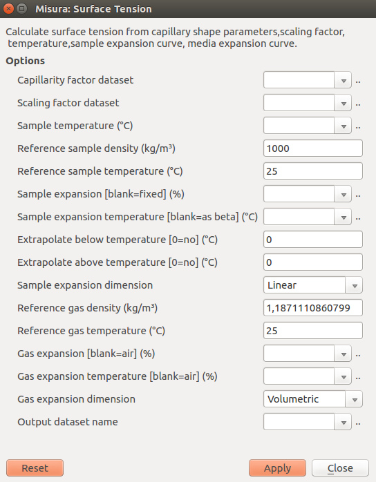

.. include:: ../substitutions.txt

Surface Tension with the Sessile Drop method
================================================

|m4| |mx| can extrapolate the surface tension of the sample from its shape and some additional parameters about the material and the atmosphere.

The method relies on the numerical solution of the Young-Laplace equation for the surface tension of a sessile drop:

.. math::
	p_1 - p_2 = \gamma (\frac{1}{R_1} + \frac{1}{R_2})
	
Where:
* :math:`p_1` is the pressure on the internal wall of the drop (material against atmosphere)
* :math:`p_2` is the pressure on the external wall of the drop (atmosphere against material)
* :math:`\gamma` is the surface tension
* :math:`R_1` is the first curvature radius describing the upper-half of the drop
* :math:`R_2` is the second curvature radius describing the upper-half of the drop

The analysis is split in two phases:

1. During a normal :ref:`heating_microscope` test, adimensional shape parameters are calculated by solving the Young-Laplace equation for the sessile drop.
2. Once the test is finished, it can be loaded in the :ref:`browser` to calculate the surface tension from the adimensional parameters. In this phase the user should provide additional material's and environmental properties like density, thermal expansion, atmosphere etc.

This design allows the user to change/correct any material property without the need to re-run the entire analysis.

Phase 1: Activating the Sessile Drop
-------------------------------------

Sessile drop analysis can be activated in each sample's Analyzer configuration panel, by setting to `True` the **Enable sessile drop analysis** (default=`False`) option.
Alternatively, from the :ref:`camera_samples` submenu in :ref:`camera` windows, you can directly turn this option on or off. 

This option can turned on/off also while the test is already running, and will take immediate effect, starting/stopping/resuming the analysis.

As the analysis is quite computationally expensive, the algorithm will be activated when the sample assumes a *likely* shape. 

The activation is controlled by the sub-option **Contact angle limit for sessile capillarity (0=no)** (default=`100`). 
The Young-Laplace solution will not be attempted unless the contact angle between the base and the sample reaches this angle.

Another sub-option allows to tune the **Runge-Kutta integration step** used by the numerical solver.

During this phase, Misura will create two adimensional sample datasets which contain the solution to the Young-Laplace equation: 

* **Capillary factor** `beta`
* **Scaling factor** `r0` 

Phase 2: The Surface Tension plugin
-------------------------------------
If the sessile drop analysis was enabled during the test execution, 
the Surface Tension plugin can be called from the ``sample<N>`` node corresponding to the analyzed sample, in the :ref:`navigator`.

The surface tension plugin will ask to the user all remaining physical sample properties in order to calculate a proper surface tension 
from the adimensional parameters calculated by the image analysis.

Pre-compiled fields:

* **Capillary factor dataset**: this pre-compiled field contains the reference to the adimensional `beta` dataset obtained by the sessile drop analysis.
* **Scaling factor dataset**: referring to the adimensional `r0` dataset.
* **Sample temperature**: referring to the sample's temperature dataset.
* **Output dataset name**: the name where to save the calculated surface tension. It is possible to save multiple datasets corresponding to different configurations.

Sample density:

* **Reference sample density**: density of the sample at the reference temperature.
* **Reference sample temperature**: reference temperature at which the reference sample density is measured.

Sample thermal expansion, which will be used to correct sample density by temperature:

* **Sample expansion**: if left blank, assume no expansion (and no density change). Else, point to an expansion % dataset for the material (height, volume or the expansion curve coming from a dilatometer).
* **Sample expansion temperature**: if the sample expansion datasets comes from a different test (a dilatometer) this field should point to the sample's temperature of that test.
* **Extrapolate below temperature**: do no trust expansion values below this temperature. Use linear extrapolation instead.
* **Extrapolate above temperature**: do no trues expansion values above this temperature. Use linear extrapolation instead.
* **Sample expansion dimension**: specify if the Sample expansion dataset is linear or volumetric.

Atmosphere density:

* **Reference gas density**: Gas density at the reference temperature.
* **Reference gas temperature**: Reference density at which the reference gas density is measured.

Gas thermal expansion, which will be used to correct gas density by temperature:

* **Gas expansion**: if left blank, assume reference air expansion.Else, point to an expansion % dataset for the gas.
* **Gas expansion temperature**: temperature dataset used for the gas expansion values.
* **Gas expansion dimension**: specify if the Gas expansion dataset is linear or volumetric.

