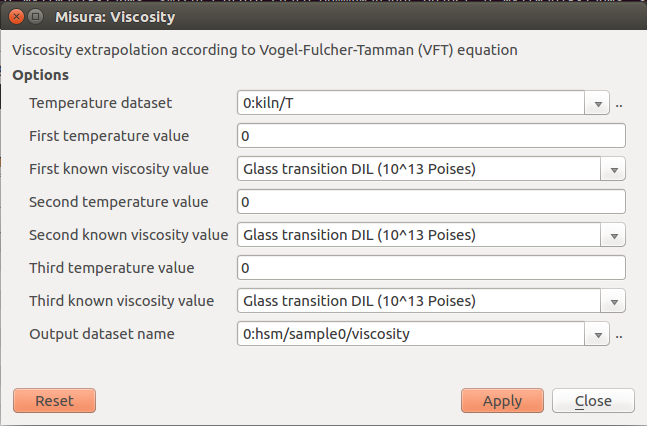
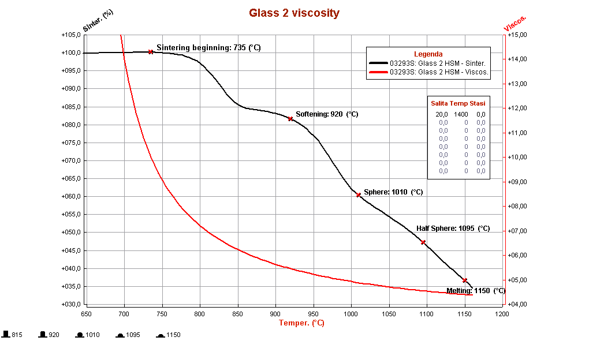
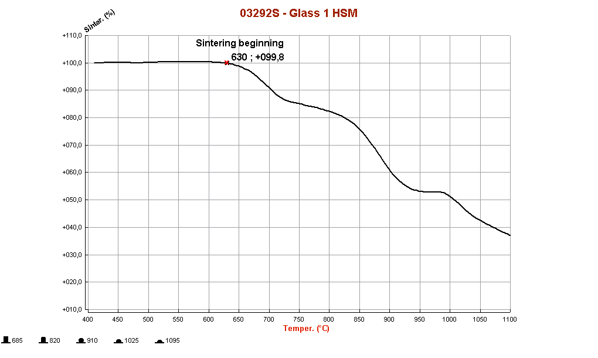

.. include:: ../substitutions.txt

.. _viscosity:

Viscosity 
==========

The determination of the viscosity curve of glasses is performed using data supplied by the heating microscope and by a dilatometer. 
This method is based on the Vogel-Fulcher-Tammann (VFT) equation.

.. math::

	log \eta = A + \frac{B}{ T - T_0 }
	
The determination of the parameters A, B and T0 is done using three pairs of known temperature-viscosity (η,T) values. 

According to Scholze (1962) and Ferrari, Magrini and Brunetti (1980), in correspondence of some characteristic points of glasses, 
it has been established that the viscosity values are fairly constant:

* Glass transition temperature: log η = 13 Poises
* Softening point (calculated with a mechanical dilatometer): log η = 10,25 Poises
* Sintering beginning: log η = 10 Poises
* Softening point (calculated with an optical dilatometer): log η = 8,2 Poises
* Sphere temperature: log η = 6,1 Poises
* Half sphere temperature: log η = 4.5  Poises

 (1 Poise= 0.1 Pa * s)

These data allow to solve the equations system to determine A, B and T0. 
Applying the VFT equation, the viscosity trend can be completely reconstructed, 
right across the temperature range. This operation is completely automatic, 
once inserted in the software three of the six temperatures mentioned above. 

.. _viscosity_plugin:

Calling the viscosity plugin
------------------------------
It is necessary to open the softening test of the material you are interested in the :ref:`browser`. Then:

1. On the :ref:`nagivator`, locate the ``sample<N>`` node corresponding to your sample (``sample0`` in single tests).
2. Right-click on the node to access the context menu. Select viscosity entry.

The viscosity parameters window will open:

The **Temperature dataset** field refers to the temperature values which will be used to calculate the viscosity. It is pre-compiled and should not be modified.

Three temperature-known viscosity pairs are then listed. Each pair consists of a temperature, which should be manually added by the user, and a known viscosity point, 
which should be selected from the drop-down menu. Each known viscosity value should be unique in this window. 

The user can also insert a viscosity number, if none of listed viscosities is considered satisfactory for the analyzed material.

The order of viscosity points does not matter.

The **Output dataset name** comes precompiled and shows the name of the dataset where the viscosity data will be stored. 
It is possible to run multiple viscosity calculations, 
with different known point combinations, by giving them different output names (like viscosity_1, _2, etc).

After clicking on **Apply** button, a new viscosity dataset will be created as a sub-node of sample temperature. It can then be plotted and managed the usual way.

The viscosity parameters and outputs will be saved with the current plot.

The viscosity data are expressed as viscosity logarithm (log η), in Poises. 

An example of viscosity curve obtained for a glass is provided below: 

Choosing the known temperature points
---------------------------------------
As mentioned above, Scholze proposed six values in correspondence of which the viscosity values can be considered fairly constant.

But if the three values chosen to calculate viscosity are too close each other, the viscosity curve cannot be calculated correctly. 
For this reason, it is necessary to follow the procedures described below, and not to choose three random values among the six. 

The choice of the three temperatures is fundamental in order to perform the viscosity calculation in a correct way. 

Now it is necessary to distinguish two cases: 

    1. your laboratory is equipped with |m4| Heating Microscope and Horizontal or Vertical Optical Dilatometer;
    2. your laboratory is equipped with |m4| Heating Microscope and a traditional mechanical dilatometer.
 
Microscope and Optical Dilatometer
^^^^^^^^^^^^^^^^^^^^^^^^^^^^^^^^^^^

In this case, the viscosity calculation is performed using data provided by the horizontal optical dilatometer and by the heating microscope. 
The values employed correspond to the temperatures of glass transition (optical dilatometer), sintering beginning and half sphere (heating microscope).

A preliminary thermal expansion tests is performed with the optical non-contact dilatometer, 
in order to obtain the expansion curve of the sample analyzed, identifying its glass transition temperature (the heating rate can be 20°C/min).

The second step consists of a softening test with the |m4| Heating Microscope, 
in order to determine the two temperatures of “sintering beginning” and “half sphere”. 

We identify manually the sintering beginning point in correspondence of the shrinkage onset, 
as shown in the following graph. The half sphere temperature is automatically identified by the software. 

Then, you should insert the values of glass transition (“Glass transition DIL”) obtained from the dilatometric test performed with MISURA ODLT, 
sintering beginning (“Sintering beginning HSM”) and half sphere (“Half sphere HSM”), obtained with the heating microscope. 

Microscope and Mechanical Dilatometer
^^^^^^^^^^^^^^^^^^^^^^^^^^^^^^^^^^^^^^

You can measure viscosity using the data provided by a mechanical dilatometer. 
In fact, you can use the temperatures of glass transition and dilatometric softening (from a mechanical dilatometer) 
and half sphere (from heating microscope). 

You should insert the two values of glass transition (“Glass transition DIL”) and dilatometric softening (“Softening point DIL MEC”), 
obtained from the dilatometric test performed with a mechanical dilatometer. 
The third value is the “half sphere” temperature, obtained with the heating microscope. 

